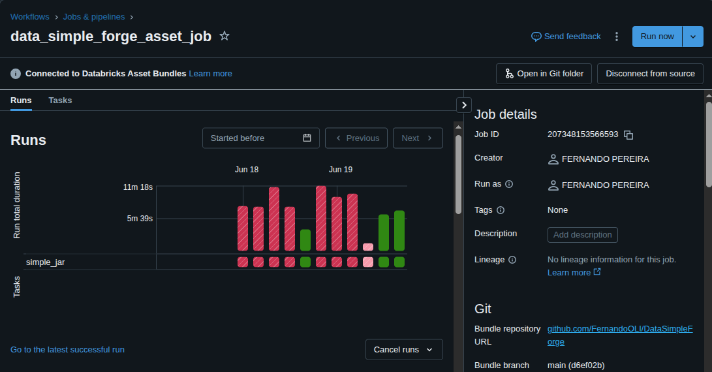
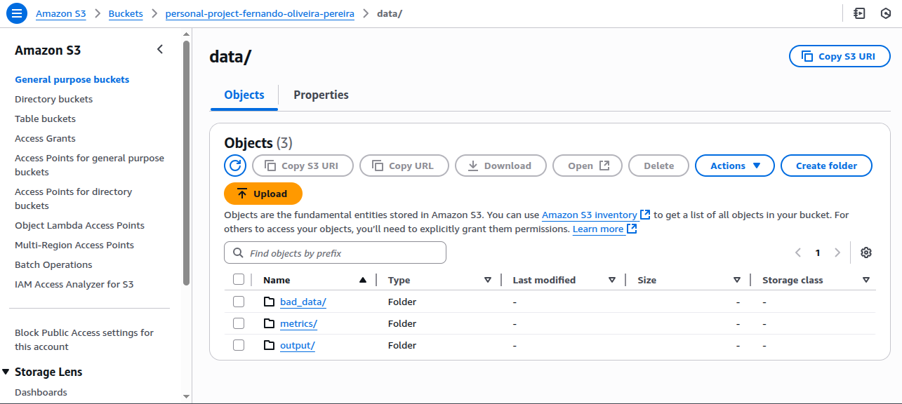
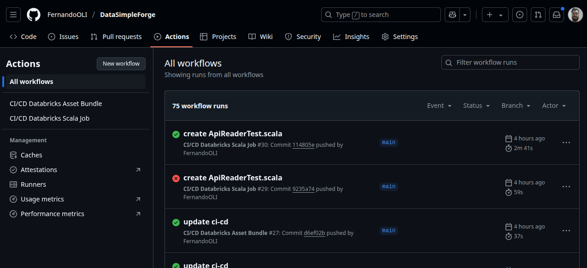

---

# DataSimpleForge — Technical Documentation

---

## 1. Introduction / Overview

**DataSimpleForge** is a Scala-based data engineering project designed to ingest and process data from public APIs, storing the output in a **Delta Lake**. The pipeline is built for both local and Databricks cloud execution, with CI/CD automation handled via **GitHub Actions**.

The main goal is to provide a robust and scalable ingestion framework, leveraging modern technologies like **Apache Spark**, **Delta Lake**, and **CI/CD pipelines** to automate the full data flow.

---

## 2. System Architecture

The project is divided into three main components:

* **Data Collection:**
  Reads data from public APIs with support for date and parameter customization.

* **Data Processing:**
  Transforms and validates the data using Spark.

* **Data Storage:**
  Writes data into Delta Lake tables, ensuring schema enforcement and versioning.

> *(Optional: Add a system diagram here, e.g., `./docs/system-architecture.png`)*

### High-Level Data Flow:

1. API →
2. Spark Transformations →
3. Delta Lake Storage →
4. CI/CD Deploy to Databricks

---

## 3. Setup and Installation

### Prerequisites

* Java 11+
* Scala 2.12+
* SBT (Scala Build Tool)
* Databricks CLI configured
* A Databricks workspace (for cloud execution)

### Installation Steps

1. Clone the repository:

   ```bash
   git clone https://github.com/FernandoOLI/DataSimpleForge.git
   cd DataSimpleForge
   ```

2. Configure environment variables and runtime parameters inside the `application.conf` or by passing them as command-line arguments (e.g., date ranges, API URLs).

3. Build the project:

   ```bash
   sbt clean compile
   ```

---

## 4. Pipeline Execution

### Local Execution

You can run the main ingestion job locally for testing:

```bash
sbt run
```

Make sure to pass the required parameters (e.g., ingestion period, API URL).

### Databricks Execution

* Deploy the generated JAR via GitHub Actions or manually through the Databricks UI.
* Trigger execution via Databricks Jobs or Notebooks linked to the deployed JAR.
  

### AWS
After execution, three delta tables will be generated in the AWS folder:

output -> with the data processed by the API.

bad_data-> Data that was removed from the output, as it had values outside the latitude and longitude.

metrics-> data with execution date, total data, total valid data, total invalid data, and url.


---

## 5. CI/CD Pipeline

The project includes a fully automated **GitHub Actions pipeline** for:

* Building the Scala project with SBT
* Running unit and integration tests
* Uploading JAR files and Databricks Asset Bundles
* Deploying jobs and configurations to **Databricks**

This ensures reliable and consistent deployments with automated builds and tests.

### Required Environment Variables (GitHub Actions Secrets)

For the CI/CD pipeline to work, you must configure the following secrets in your GitHub repository:

| Secret                  | Description                                                             | How to create                                                                                                                                                    |
| ----------------------- | ----------------------------------------------------------------------- | ---------------------------------------------------------------------------------------------------------------------------------------------------------------- |
| `AWS_ACCESS_KEY_ID`     | Your AWS access key (if you’re storing build artifacts like JARs in S3) | Go to AWS Console → IAM → Create a new User → Enable **Programmatic Access** → Attach necessary policies (e.g., AmazonS3FullAccess) → Copy the **Access Key ID** |
| `AWS_SECRET_ACCESS_KEY` | Your AWS secret key                                                     | During the same IAM user creation process → Copy the **Secret Access Key**                                                                                       |
| `DATABRICKS_HOST`       | The URL of your Databricks workspace                                    | In Databricks UI → Click on your profile icon → **User Settings** → Copy your workspace URL (e.g., `https://<databricks-instance>.cloud.databricks.com`)         |
| `DATABRICKS_TOKEN`      | Databricks Personal Access Token (PAT)                                  | In Databricks UI → **User Settings** → **Generate New Token** → Copy and store it securely                                                                       |

---

### How to Configure Secrets in GitHub

1. Go to your repository on GitHub.
2. Click on **Settings** → **Secrets and Variables** → **Actions** → **New repository secret**.
3. Create each secret (`AWS_ACCESS_KEY_ID`, `AWS_SECRET_ACCESS_KEY`, `DATABRICKS_HOST`, `DATABRICKS_TOKEN`).
4. Ensure all secrets are available before running the pipeline.

---

### CI/CD Workflow File Location

The CI/CD workflow file is located at:

```
.github/workflows/databricks-bundle.yml
```

> This YAML file defines all the steps for build, test, upload, and deployment.

---

## 6. Testing

We use **ScalaTest** for unit and basic integration testing.

To run tests locally:

```bash
sbt test
```

Test coverage includes:

* Core transformation logic
* Delta Lake read/write validation
* API ingestion behavior

It’s recommended to run tests before every deployment.

---

## 7. Observability and Logging

The project uses **log4j** for logging. Logs are printed to the console during local execution and can be viewed in the Databricks job run history when executed in the cloud.

### Log configuration:

You can adjust the logging level in the `log4j.properties` file.

---

## 8. Best Practices and Recommendations

* Keep dependencies updated and tested regularly.
* Always validate input parameters to avoid ingestion failures.
* Consider implementing monitoring or alerting on Databricks job failures.
* Document any major code or pipeline changes to help future maintainers.

---

## 9. References

* [Apache Spark Documentation](https://spark.apache.org/docs/latest/)
* [Delta Lake Documentation](https://docs.delta.io/latest/index.html)
* [Databricks Documentation](https://docs.databricks.com/)
* [ScalaTest](https://www.scalatest.org/)
* Maintainer: Fernando Oliveira — [LinkedIn](https://www.linkedin.com/in/fernando-oliveira-b81032b4/)

---
